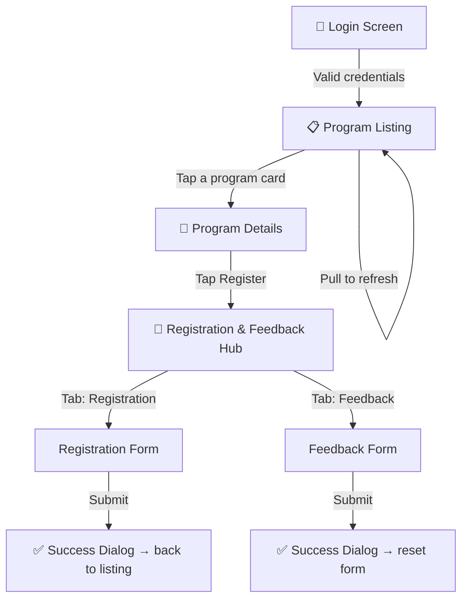

# Elevate

> **A Flutter mobile application that helps learners discover, explore, and register for professional development programs.**

[](https://flutter.dev)
[](https://dart.dev)
[](LICENSE)

---

## 📖 Table of Contents

1. [Project Overview](#-project-overview)
2. [Key Features](#-key-features)
3. [Screenshots & Navigation Flow](#-navigation-flow)
4. [Tech Stack](#-tech-stack)
5. [Project Structure](#-project-structure)
6. [Data Models](#-data-models)
7. [Services & API](#-services--api)
8. [Theme & Design System](#-theme--design-system)
9. [Getting Started](#-getting-started)
10. [Configuration](#-configuration)
11. [Roadmap](#-roadmap)
12. [Team](#-team)

---

## 🎯 Project Overview

**Elevate** is a cross-platform Flutter mobile app built to bridge the gap between learners and professional development opportunities. Users can browse upcoming programs across categories like **Leadership**, **Tech Skills**, **Wellness**, and **Career Development**, view full program details including schedules and eligibility criteria, and register directly from the app.


## ✨ Key Features

| Feature | Description |
|---|---|
| 🔐 **Secure Login** | Email/password form with validation. Simulates network authentication with a loading state. |
| 🗂️ **Program Listing** | Scrollable card list of all available programs, fetched from a REST API. Pull-to-refresh supported. |
| 🔍 **Search & Filter** | Real-time search by program title or provider. Category filter chips (All, Leadership, Tech Skills, Wellness, Career). |
| 📋 **Program Details** | Full-page view with hero image, description, provider, schedule, eligibility criteria, and a Register CTA. |
| 📝 **Registration Form** | Collect Name, Email, Phone, and Experience Level. Submits via HTTP POST to the Mock API. Success/error dialogs. |
| 💬 **Feedback Form** | Satisfaction rating (dropdown) + free-text comments. Submits via HTTP POST to the same API. |
| ⚠️ **Error Handling** | Friendly error screens with retry buttons for network failures, timeouts, and bad JSON responses. |
| 🎨 **Brand Design System** | Consistent Excelerate color palette (coral → pink → magenta gradient), reusable widgets and card components. |

---

## 🧭 Navigation Flow


```mermaid
flowchart TD
    A[🔑 Login Screen] -->|Valid credentials| B[📋 Program Listing]
    B -->|Tap a program card| C[📄 Program Details]
    B -->|Pull to refresh| B
    C -->|Tap Register| D[📝 Registration & Feedback Hub]
    D -->|Tab: Registration| E[Registration Form]
    D -->|Tab: Feedback| F[Feedback Form]
    E -->|Submit| G[✅ Success Dialog → back to listing]
    F -->|Submit| H[✅ Success Dialog → reset form]
```

**In plain words:**

1. The user opens the app on the **Login** screen and enters their credentials.
2. After login they land on **Program Listing**, which loads programs from the API with a loading spinner. A pull-down gesture refreshes the list.
3. From the listing screen, they can **search** by keyword or **filter by category** using the chip row.
4. Tapping a program card opens **Program Details**, showing the full description, schedule, and eligibility criteria.
5. Tapping **Register** opens the **Forms Hub**, a tabbed screen that hosts both the Registration Form and the Feedback Form.
6. Submitting either form sends a POST request to the API and shows a confirmation dialog.

---

## 🛠 Tech Stack

| Layer | Technology |
|---|---|
| **Framework** | Flutter 3 / Dart 3 |
| **HTTP Client** | [`http ^1.2.2`](https://pub.dev/packages/http) |
| **API** | MockAPI REST (`https://mockapi.io`) |
| **State Management** | Flutter built-in `StatefulWidget` + `FutureBuilder` |
| **Design** | Material 3, custom `AppTheme`, `AppColors` |
| **Platform targets** | Android · iOS · Web · macOS · Linux · Windows |

---

## 📁 Project Structure

```
lib/
├── main.dart                          # App entry point; wires theme + initial route
│
├── screens/
│   ├── login_screen.dart              # Email/password login with form validation
│   ├── program_listing_screen.dart    # Browseable list with search & category filters
│   ├── program_details_screen.dart    # Full program info + Register button
│   └── registration_feedback_screen.dart  # Tabbed Registration & Feedback forms
│
├── models/
│   ├── program.dart                   # Program data class + fromJson / toJson
│   ├── event.dart                     # Event data class (proposed, future use)
│   ├── expense.dart                   # Expense data class (legacy, future use)
│   ├── spend_category.dart            # SpendCategory data class (legacy)
│   └── json_helpers.dart              # readString / readStringList helpers
│
├── services/
│   ├── api_service.dart               # Generic HTTP client, error handling, parsing
│   └── program_service.dart           # Provides mock program data (simulates API)
│
├── widgets/
│   └── bottom_nav_bar.dart            # Shared bottom navigation bar widget
│
└── theme/
    ├── app_colors.dart                # Brand color constants + gradient
    └── app_theme.dart                 # MaterialTheme light configuration
```

---


## 🔌 Services & API

### `ApiService`

A generic, injectable HTTP client that handles the full lifecycle of an API call:

1. **Request** — GET with `Accept: application/json`, 10 s timeout.
2. **HTTP status check** — throws `ApiException` for any non-2xx status.
3. **JSON decoding** — decodes `utf8` bytes, validates the response is a `List`.
4. **Model parsing** — passes each item to a caller-supplied `fromJson` factory; any `FormatException` becomes an `ApiException` with the item index.

The base URL is configurable at build time:

```bash
flutter run --dart-define=API_BASE_URL=https://your-api.mockapi.io/api/v1
```

**Error type:** `ApiException(message, {statusCode?})` — always a human-readable English message, safe to display directly in the UI.


### Mock API Endpoint

| Method | URL | Purpose |
|---|---|---|
| `GET` | `/api/v1/programs` | Fetch all programs |
| `POST` | `/api/v1/programs` | Submit registration or feedback |

Base URL: `https://6adc37259cae184827ad0d2b.mockapi.io/api/v1`


## 🚀 Getting Started

### Prerequisites

- [Flutter SDK](https://docs.flutter.dev/get-started/install) ≥ 3.x  
- Dart SDK ≥ 3.x  
- An emulator, simulator, or physical device (or Chrome for web)

Run `flutter doctor` to verify your setup.

### Installation

```bash
# 1. Clone the repository
git clone <repository-url>
cd Speed_wise_app
>>>>>>> 2752416 ( i have updated the Readme to me more detailed)

 * Install dependencies:
   flutter pub get

# 3. Run on your target device
flutter run

# Run on Chrome (web)
flutter run -d chrome

# Build a release APK
flutter build apk --release
```

---


## 👥 Team

**Team 3 — 0510 SLU MAD**

| Name | Role |
|---|---|
| Shimaa Kamal M | Team Lead / UI / Developer| 
| Adeniyi Adeyinka | Developer |
| Ange Mukundente | Developer |
| Chaudhary Siddhant Baliyan | Developer |
| Sandile Ndroi | Developer |


---

> Built as part of a mobile app development internship · Powered by Flutter & Dart
